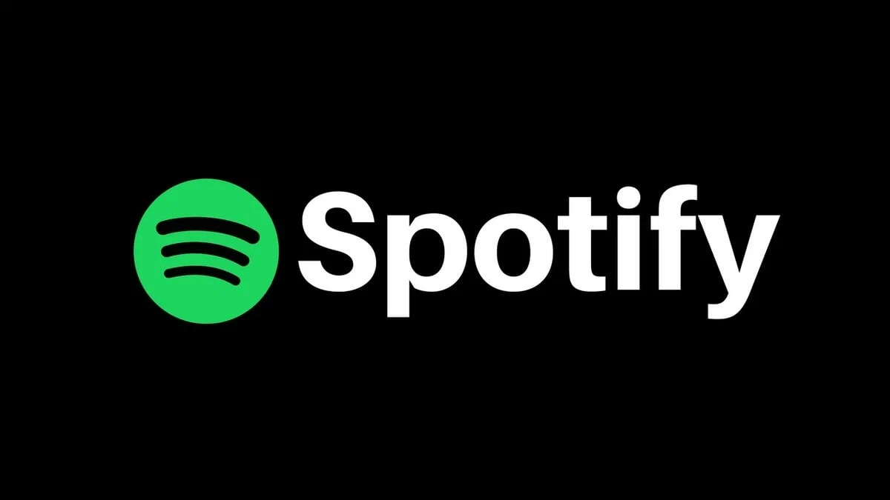

<div align="center">

# 🎵 Spotify Hit Prediction

**Predicting Spotify hits using Machine Learning**

[](https://python.org)
[](https://fastapi.tiangolo.com)
[](https://xgboost.readthedocs.io)
[](https://docker.com)



</div>

## 📋 About the Project

This project is a comprehensive solution for predicting musical hits based on Spotify data. The project includes data exploration, training of various machine learning models, and deployment of a web API for practical use.

### 🎯 Main Objectives

- **Data Analysis**: Research on musical characteristics that influence track popularity
- **Modeling**: Comparison of various machine learning algorithms to select the optimal one
- **Production**: Creation of a ready-to-use API for hit prediction

### 📊 Data Source

Data is sourced from [Kaggle Dataset](https://www.kaggle.com/theoverman/the-spotify-hit-predictor-dataset) and contains musical characteristics of tracks from 1960 to 2019.

## 🏗️ Project Structure

```
Spotify_prediction/
├── 📓 Spotify_prediction.ipynb    # Main notebook with analysis and training
├── 📄 Research_report.md          # Detailed research report
├── 🌐 music-classifier/           # FastAPI application
│   ├── app/                       # Main API code
│   ├── Dockerfile                 # Docker configuration
│   ├── docker-compose.yml         # Docker Compose settings
│   └── requirements.txt           # Python dependencies
├── 📁 data/                       # Source data
└── 📁 assets/                     # Images and resources
```

## 🚀 Quick Start

### 1. 📊 Data Analysis

Open the main notebook to explore the research:
```bash
jupyter notebook Spotify_prediction.ipynb
```

### 2. 🌐 API Launch

#### Local Launch
```bash
cd music-classifier
pip install -r requirements.txt
python app/main.py
```

#### Docker Launch
```bash
cd music-classifier
docker-compose up --build
```

API will be available at: `http://localhost:8000`

### 3. 🧪 API Testing
```bash
cd music-classifier
python test_api.py
```

## 🔬 Methodology

### Machine Learning Algorithms
- **XGBoost** (main model) - gradient boosting
- **Random Forest** - ensemble of decision trees  
- **Logistic Regression** - logistic regression
- **Neural Networks** - neural networks with PyTorch
- **SVM** - support vector machines
- **CatBoost** - gradient boosting by Yandex

### Data Processing
- **BERT embeddings** for track names and artists
- **Feature engineering** for musical characteristics
- **Cross-validation** for model quality assessment
- **Hyperparameter optimization** with Optuna

## 📈 Results

- **Best model**: XGBoost with accuracy > 85%
- **Important features**: danceability, energy, valence, tempo
- **Time coverage**: 60 years of musical history (1960-2019)

## 🔧 Technology Stack

### Data Science
- **Python** - main programming language
- **Pandas** - data processing
- **NumPy** - numerical computations
- **Scikit-learn** - machine learning
- **XGBoost** - gradient boosting
- **PyTorch** - deep learning

### API and Deployment
- **FastAPI** - modern web framework
- **Docker** - containerization
- **Uvicorn** - ASGI server
- **Pydantic** - data validation

### Visualization
- **Matplotlib** - basic plots
- **Seaborn** - statistical visualization
- **Plotly** - interactive plots

## 📚 Documentation

- **[📓 Main Research](Spotify_prediction.ipynb)** - complete data analysis and model training
- **[📄 Research Report](Research_report.md)** - detailed description of methodology and results
- **[🌐 API Documentation](music-classifier/README.md)** - API usage guide

## 🔗 API Endpoints

| Endpoint | Method | Description |
|----------|--------|-------------|
| `/health` | GET | API and model status check |
| `/predict` | POST | Single track prediction |
| `/batch_predict` | POST | Batch prediction |

## 🤝 Contributing

This project was created for educational purposes to demonstrate data science skills and ML solution development. Suggestions for improvements are welcome!

## 📄 License

This project is distributed under the MIT License. See the [LICENSE.md](LICENSE.md) file for details.

---