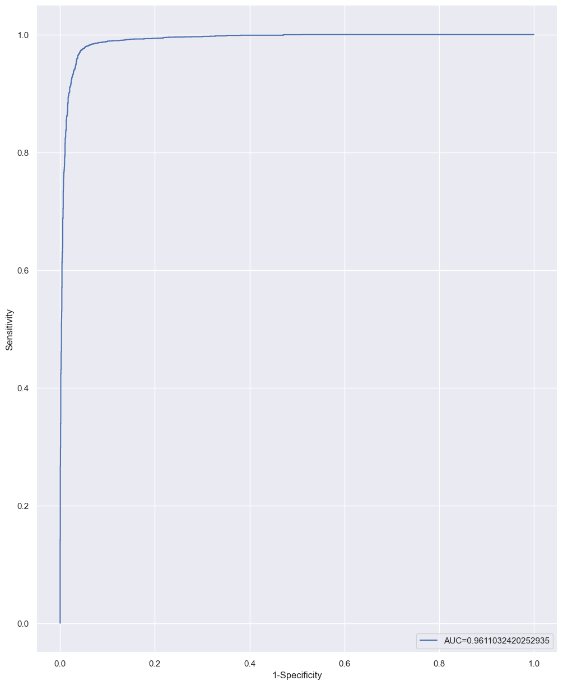

# Spotify hits prediction

## Table of Contents

- [Problem Setting](#problem-setting)
- [Problem Definition](#problem-definition)
- [Data Source](#data-source)
- [Data Description](#data-description)
- [Data Collection](#data-collection)
- [Data Processing](#data-processing)
- [Data Exploration](#data-exploration)
   - [Data Statistics](#data-statistics)
   - [Data Distributions](#data-distributions)
- [Model Exploration and Model Selection](#model-exploration-and-model-selection)
- [Xgboost Performance Evaluation and Interpretation](#xgboost-performance-evaluation-and-interpretation)
   - [Precision](#precision)
   - [Recall (Sensitivity)](#recall-sensitivity)
   - [ROC Curve](#roc-curve)
- [Project Results](#project-results)
- [Impact of the Project Outcomes](#impact-of-the-project-outcomes)

## Problem Setting

The music industry is a multibillion-dollar industry consisting of artists of diverse backgrounds producing songs in various genres that influence people worldwide. Yet, there are only a handful of songs and artists that make it to the top of the billboards. By taking historical data for every decade from 1960 to 2019 on Spotify, we try to predict if the track will be a hit or not.

## Problem Definition

In this dataset created by fetching features from Spotify’s Web API, we try to classify a track  as a ‘Hit’ or not for every decade from 1960 to 2019. We try to use multiple classification  models and assess their performance to pick the optimal one.

## Data Source

The dataset for this project is acquired from Kaggle:

https://www.kaggle.com/theoverman/the-spotify-hit-predictor-dataset

## Data Description

This dataset consists of 41,106 songs with 19 attributes from 6 different decades from 1960  to 2019. The target variable is a label, indicating that a song is a hit (1) or flop (0). The track is considered a flop following these conditions:

1. The track must not appear in the 'hit' list of that decade.
2. The track's artist must not appear in the 'hit' list of that decade.
3. The track must belong to a genre that could be considered non-mainstream and/or Avant-
    grade.
4. The track’s genre must not have a song on the ‘hit’ list.
5. The track must have ‘US’ as one of its markets.

Other attributes of the dataset are tracks, artist, Uri, danceability, energy, key, loudness, mode, speechiness, acousticness, instrumentalness, liveness, valence, tempo, duration, etc.

  
     
			
     
	Figure 1 : Data Sample with Descriptions

## Data Collection

We downloaded and extracted the 6 CSV files corresponding to the data of each of the decades and then merged them into a single dataframe.

## Data Processing

We determined the shape of the data to see how many records and columns are present. We  saw that all the **41,106** records and **19** columns have been successfully imported.  In the next step, we looked at the data types and checked if we needed to convert any of them.  We observed that we didn’t need to make any explicit data type conversion.  Next, we checked if there were any missing values or nulls present in our data. We could see  that there are no null values or any missing values in the dataset.  Lastly, we looked at the statistics of the data set. We gathered insights about the mean,  median, and range of the data of all our variables.  Further, we observed that amongst the predictor variables, two of the columns can be  considered categorical. These would be the ‘Mode’ and ‘Time Signature’ columns. These  wouldn’t necessarily need to be converted since they are already numerical.  Our Response variable is the target column which holds only binary values of ‘0’ and ‘1’  which indicates if a song is a Hit or not.

## Data Exploration

### Data Statistics

In this part, we looked at the statistics of the variables.

|                  |     danceability    |     energy          |     key             |     loudness        |     mode            |     speechiness     |     acousticness    |
|------------------|---------------------|---------------------|---------------------|---------------------|---------------------|---------------------|---------------------|
|     **Count**    |     41106.000000    |     41106.000000    |     41106.000000    |     41106.000000    |     41106.000000    |     41106.000000    |     41106.000000    |
|     **Mean**     |     0.539695        |     0.579545        |     5.213594        |     -10.221525      |     0.693354        |     0.072960        |     0.364197        |
|     **Std**      |     0.177821        |     0.252628        |     3.534977        |     5.311626        |     0.461107        |     0.086112        |     0.338913        |
|     **min**      |     0.000000        |     0.000251        |     0.000000        |     -49.253000      |     0.000000        |     0.000000        |     0.000000        |
|     **25%**      |     0.420000        |     0.396000        |     2.000000        |     -12.816000      |     0.000000        |     0.033700        |     0.039400        |
|     **50%**      |     0.552000        |     0.601000        |     5.000000        |     -9.257000       |     1.000000        |     0.043400        |     0.258000        |
|     **75%**      |     0.669000        |     0.787000        |     8.000000        |     -6.374250       |     1.000000        |     0.069800        |     0.676000        |
|     **max**      |     0.988000        |     1.000000        |     11.000000       |     3.744000        |     1.000000        |     0.960000        |     0.996000        |

From the statistics, we can see that almost all the values for the predictor time_signature are

|               |     instrumentalness    |     liveness    |     valence     |     tempo         |     duration_ms     |     Chorus_hit    |     sections      |     time_signature    |
|---------------|-------------------------|-----------------|-----------------|-------------------|---------------------|-------------------|-------------------|-----------------------|
|     **count** |     41106.000000        |     41106.00    |     41106.00    |     41106.00      |     4.110600e+04    |     41106.000     |     41106.00      |     41106.00          |
|     **mean**  |     0.154416            |     0.201535    |     0.542440    |     119.338249    |     2.348776e+05    |     40.106041     |     10.475673     |     3.8936            |
|     **std**   |     0.303530            |     0.172959    |     0.267329    |     29.098845     |     1.189674e+05    |     19.005515     |     4.871850      |     0.4230            |
|     **min**   |     0.000000            |     0.013000    |     0.000000    |     0.000000      |     1.516800e+04    |     0.000000      |     0.000000      |     0.00              |
|     **25%**   |     0.000000            |     0.094000    |     0.330000    |     97.397000     |     1.729278e+05    |     27.599792     |     8.000000      |     4.00              |
|     **50%**   |     0.000120            |     0.132000    |     0.558000    |     117.565000    |     2.179070e+05    |     35.850795     |     10.000000     |     4.00              |
|     **75%**   |     0.061250            |     0.261000    |     0.768000    |     136.494000    |     2.667730e+05    |     47.625615     |     12.000000     |     4.00              |
|     **max**   |     1.000000            |     0.999000    |     0.996000    |     241.423000    |     4.170227e+06    |     433.182000    |     169.000000    |     5.00              |

4. Hence, we decide to remove this predictor in this step.

### Data Distributions

In this part first, we create a boxplot to look for outliers and see the distribution of all the predictors.

  
     
			
     
	Figure 2 : Distribution of Scaled Predictors with outliers

There are many outliers in the data in predictors such as instrumentalness and Spechiness. They have 8920, and 5088 outliers respectively, therefore we remove these two predictors completely and after that remove all the observations which have an outlier.

After removing the outliers, we have 33401 songs and 12 predictors for building the model.

  
     
			
     
	Figure 3 : Distribution of the Scaled Predictors after removing the outliers

This boxplot illustrates the distribution of the predictors, however, as our goal is to build a classification model, exploring the distribution of the predictors by the target variable will be much more efficient.

  
     
			
     
	Figure 4 : Side by side boxplots by target variable_	

From figure 4, the predictor’s danceability, energy, loudness, acousticness, duration, liveness, sections, and valence have a different distribution amongst hit songs and other songs. Hence, they can be considered good predictors.

The total number of Songs after removing the outliers is 33401. We count the number of hit songs and other songs to find out if we need oversampling.

  
     
			
     
	Figure 5 : Count of hit songs and other songs	

From figure 5 we can see that almost half of the songs are hit, and half of the songs are not considered hit, and we do not need oversampling.

## Data preprocessing

1. Track name will be encoded via bert-like model
2. Artist name will be encoded via target encoder. Because i think that connection between artist and popularity of his track is obvious and we should use them
3. Decade of release will be encoded wia One-hot encoder like typycal categorial column 
4. Numerical columns will be scaled

## Model Exploration and Model Selection

The purpose of this project is to predict whether a song is classified as a hit song or is classified as a non-hit song. Hence, the goal of the project is classification, we use different classification models to get the best results. At first, 8 models are selected for this classification task. These models are:

1. Logistic Regression
2. K-Nearest Neighbors
3. Support Vector Machine (Linear Kernel)
4. Support Vector Machine (RBF Kernel)
5. Neural Network(sklearn)
6. Random Forest
7. Catboost
8. Xgboost
9. LinearDiscriminantAnalysis
10. Gaussian Naive Bayes
11. Ridge

Next, we split the dataset into 80% training and 20% testing datasets. We use 3-Fold cross validation to choose the best models. The Scores of the models are shown in table 1.

|                 Model                  | Score |
|:--------------------------------------:|:-----:|
|          Logistic Regression           | 95.3% |
|          K-Nearest Neighbors           | 75.9% |
| Support Vector Machine (Linear Kernel) | 95.2% |
|  Support Vector Machine (RBF Kernel)   | 93.4% |
|        Neural Network(sklearn)         | 94.2% |
|             Random Forest              | 94.6% |
|                Catboost                | 95.9% |
|                Xgboost                 | 95.6% |
|       LinearDiscriminantAnalysis       | 95.4% |
|          Gaussian Naive Bayes          | 85.8% |
|                 Ridge                  | 78.7% |

Best results showed: catboost, xgboost, log regression. Neural network showed a good potential, we should try to build a torch neural network for this task

### Hyperparameter tuning and choosing the best model

In this step we build a torchNN and find the best hyperparameters for rest of the models.

Results showed below

|         Model         | Score  | Prediction time |
|:---------------------:|:------:|:---------------:|
|       Catboost        | 95.79% |      0.56       |
| Neural Network(torch) | 94.51% |      0.01       |
|    Log Regression     | 95.46% |      0.04       |
|        Xgboost        | 95.82% |      0.07       |

From the results of the tests, we choose the **Xgboost classifier** as our final model.

The model will give an accuracy of 77.74%. In the next steps, we use different methods to enhance the performance of the model and finally evaluate the model.

## Xgboost Performance Evaluation and Interpretation

For measuring the performance of the xgboost classifier, we use accuracy score, confusion matrix, Precision, Recall, and f1_score.

The accuracy of the predictions by the xgboost classifier is 73.82% on the test data. This means that the classifier predicted correctly on the test data by 73.82%. This in turn implies that the error rate is 2 6.18%.

The confusion matrix of the xgboost classifier is as follows:

|                           | Predicted Hit | Predicted Non-Hit |
|:-------------------------:|:-------------:|:-----------------:|
|      **Actual Hit**       |     3527      |        71         |
|    **Actual Non-Hit**     |      179      |       2904        |

The classification report for the test data and the predictions are:

|                      | Precision | Recall | f1-score | Support |
|:--------------------:|:---------:|:------:|:--------:|:-------:|
|     **Non-Hit**      |   0.98    |  0.94  |   0.96   |  3083   |
|       **Hit**        |   0.95    |  0.98  |   0.97   |  3598   |
|     **accuracy**     |           |        |   0.96   |  6681   |
|    **macro avg**     |   0.96    |  0.96  |   0.96   |  6681   |
|   **weighted avg**   |   0.96    |  0.96  |   0.96   |  6681   |

### Precision

It is the number of correctly identified members of a class divided by all the times the model predicted that class. In the case of “hits”, the precision score would be the number of correctly identified “hits” divided by the total number of times the classifier predicted “hits,” rightly or wrongly. This value is around 95%, meaning that out of all the songs which are predicted as a hit song by the model, 95% of them are hit songs.

### Recall (Sensitivity)

It is the number of members of a class that the classifier identified correctly divided by the total number of members in that class. For “hits”, this would be the number of actual “hits” that the classifier correctly identified as such. This value is 98%, meaning that out of all the hit songs, 98% are correctly classified as hit songs.

### ROC Curve

  
     
			
     
	Figure 6: ROC Curve

The ROC Curve plots the sensitivity based on 1-specificity for 100 different cutoffs. Here the area under the curve is 0.96 which shows that the model is performing well. The random model has an area of 0. 5 and the best classifier has an area of 1.

## Project Results

In the original dataset consisting of 40k records, there were multiple outliers in the initial 19 features. The features with the most outliers are removed. The remaining dataset is then split into a train test split of 80 – 20. The classification models such as Logistic Regression, K-Nearest Neighbors, Decision Tree, Support Vector Machine (Linear Kernel), Support Vector Machine (RBF Kernel), Neural Network, Random Forest, catboost, xgboost, torch neural network and Gradient Boosting are considered. The results show that the xgboost model is the best classification model for our dataset. It was able to classify hit songs and non-hit songs with an accuracy of **96%.**

The precision, recall, and the area under the ROC curve showed that the model is performing well. For hit songs, the Recall was 98% meaning that out of all the hit songs, the model predicted it correctly 98% of the time.

## Impact of the Project Outcomes

As the global music industry is moving more and more towards online audio streaming services such as Spotify, this project provides insights into what makes a song a hit on the billboard. Through this project, the importance of a variety of features like ‘loudness’ and ‘energy’ is observed in making a song hit or not. This will in turn help artists, producers, and even online streaming platforms make better business decisions, promotions, and what would be in the making of a popular song globally. The goal of the project was to accurately label a hit song as ‘1’ or ‘0’ otherwise. In this regard, the catboost classifier outperformed all other classifiers with its high recall, high precision, and high f1 scores for hit songs. From the analysis in this project, The Random Forest classification model could be used to predict hit songs. It accurately determines hit songs and works best for predictors that are highly diverse and varied, which would have been difficult to do so in the past.
